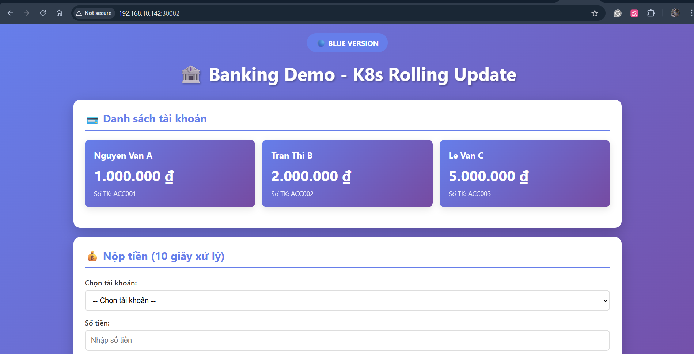

# KUBERNETES GRACEFUL SHUTDOWN

Source code: https://github.com/TranChucThien/k8s-graceful-shutdown-demo

# **0. LÝ THUYẾT SPRING BOOT SHUTDOWN**

### **2 Trường Cấu Hình**

**1. server.shutdown**

- `immediate`: Đóng server socket ngay, hủy requests đang xử lý
- `graceful`: Đóng server socket, nhưng chờ requests hoàn thành

**2. spring.lifecycle.timeout-per-shutdown-phase**

- Thời gian tối đa chờ mỗi phase shutdown (SmartLifecycle beans)
- `0s`: Không chờ → Force shutdown ngay
- `30s`: Chờ tối đa 30s → Sau đó force shutdown

---

### **Immediate Shutdown**

```
server.shutdown=immediate
spring.lifecycle.timeout-per-shutdown-phase=0s
```

**Hành vi:**

- Khi nhận SIGTERM → Đóng server socket ngay
- Timeout = 0s → Không chờ request đang xử lý
- Thread bị interrupt → Transaction rollback

**Kết quả:** ❌ Mất dữ liệu

---

### **Graceful Shutdown**

```
server.shutdown=graceful
spring.lifecycle.timeout-per-shutdown-phase=30s
```

**Hành vi:**

- SIGTERM → Đóng server socket (không nhận request mới)
- Chờ tối đa 30s cho requests đang xử lý hoàn thành
- @Transactional được commit đầy đủ
- Sau 30s → Force shutdown (nếu chưa xong)

**Kết quả:** ✅ Dữ liệu an toàn

---

# **1. VẤN ĐỀ**

### **Tình huống thực tế**

- Deploy/scale down → Pod bị terminate → Transaction đang xử lý bị hủy → Mất dữ liệu

### **Kiến trúc demo**

```
User → Service → Pod (Transaction 10s) → MySQL
```

### **So sánh 2 cách**

- **BAD**: Immediate shutdown → ❌ Mất data
- **GOOD**: Graceful shutdown → ✅ An toàn

---

# **2. DEMO BAD VERSION**

### **Cấu hình BAD**

```
server.shutdown=immediate
spring.lifecycle.timeout-per-shutdown-phase=0s
```

```yaml
# ❌ Không có preStop hook
# ❌ Không có terminationGracePeriodSeconds
```

### **Demo**

```bash
# Kiểm tra số transaction hiện tại
curl -s http://192.168.10.142:30082/api/transactions | jq 'length'

# Terminal 1:  Tạo giao dịch, Request này sẽ mất 10 giây để hoàn thành.
curl -X POST http://192.168.10.142:30082/api/deposit \
  -H "Content-Type: application/json" \
  -d '{"accountNumber": "ACC001", "amount": 50000}'

# Terminal 2: Delete pod
kubectl delete pod -l app=banking-bad 

# Kiểm tra kết quả: Đếm số transaction
curl -s http://192.168.10.142:30082/api/transactions | jq 'length'

```




### **Kết quả**

- Trước khi deposit:  8 transactions
Sau khi xóa pod:    8 transactions   ⇒ KHÔNG TĂNG
- **curl: (52) Empty reply from server:**
    - Transaction đang xử lý (chưa đến 10s)
    - Pod bị xóa đột ngột
    - Connection bị đứt → **Empty reply**
    - Transaction **bị mất hoàn toàn**, không được lưu vào database

---

# **3. DEMO GOOD VERSION**

### **Cấu hình GOOD**

```
server.shutdown=graceful
spring.lifecycle.timeout-per-shutdown-phase=30s
```

```yaml
terminationGracePeriodSeconds: 60
readinessProbe: /actuator/health/readiness
livenessProbe: /actuator/health/liveness
preStop: sleep 20
maxUnavailable: 0
```

### **Demo**

```bash
# Kiểm tra số transaction hiện tại
curl -s http://192.168.10.142:30081/api/transactions | jq 'length'

# Terminal 1:  Tạo giao dịch, Request này sẽ mất 10 giây để hoàn thành.
curl -X POST http://192.168.10.142:30081/api/deposit \
  -H "Content-Type: application/json" \
  -d '{"accountNumber": "ACC001", "amount": 50000}'

# Terminal 2: Delete pod
kubectl delete pod -l app=banking-good

# Kiểm tra kết quả: Đếm số transaction
curl -s http://192.168.10.142:30081/api/transactions | jq 'length'

```

### **Kết quả**


Trước giao dịch


Trước giao dịch


Sau giao dịch

- Trước deposit:  13 transactions, Số tiền 1.300.000
Sau deposit:    14 transactions , Số tiền 1.350.000 ⇒ ✅ TĂNG LÊN như kỳ vọng
Response:       200 OK với data đầy đủ
- Pod chờ transaction xong (10s) → Response thành công → Lưu dữ liệu → Mới terminate

---

# **4. DEMO: Graceful Shutdown với 30 Requests**

### **Mục Đích**

Kiểm chứng cơ chế **Graceful Shutdown** trong Kubernetes bằng cách:

- Gửi 30 requests liên tục (mỗi giây 1 request)
- Scale down pod về 0 sau request thứ 5
- Quan sát số lượng transactions thành công/thất bại

Script demo: scripts/test-30-deposits.sh

### **Timeline Chi Tiết**

### **Phase 1: Normal Operation (0-4 giây)**


```
Giây 0 (07:50:40.231):   Request 1 gửi → Xử lý 10s → Hoàn thành 07:50:50 ✅
Giây 1 (07:50:41.240):   Request 2 gửi → Xử lý 10s → Hoàn thành 07:50:51 ✅
Giây 2 (07:50:42.245):   Request 3 gửi → Xử lý 10s → Hoàn thành 07:50:52 ✅
Giây 3 (07:50:43.251):   Request 4 gửi → Xử lý 10s → Hoàn thành 07:50:53 ✅
Giây 4 (07:50:44.255):   Request 5 gửi → Xử lý 10s → Hoàn thành 07:50:54 ✅
```

**Trạng thái:**

- ✅ Pod đang chạy bình thường
- ✅ Service routing traffic bình thường

---

### **Phase 2: Scale Down Triggered (Giây 4.5)**


```
Giây 4.5 (07:50:44.761): kubectl scale deployment banking-good --replicas=0
Kubernetes Actions:
1. Gửi SIGTERM đến pod (bị chặn bởi preStop hook)
2. Thực thi preStop: sleep 20
3. Chờ preStop hoàn thành
```

**Trạng thái:**

- ⏳ preStop hook đang chạy (sleep 20)
- ✅ Pod VẪN nhận traffic (race condition vì đang test 1 POD, trạng thái terminating=true, service=true)

---

### **Phase 3: Grace Period Window (Giây 5-24)**


```
Giây 5 (07:50:45.260):   Request 6 gửi  → Xử lý 10s → Hoàn thành 07:50:55 ✅
Giây 6 (07:50:46.xxx):   Request 7 gửi  → Xử lý 10s → Hoàn thành 07:50:56 ✅
Giây 7 (07:50:47.618):   Request 8 gửi  → Xử lý 10s → Hoàn thành 07:50:57 ✅
Giây 8 (07:50:48.623):   Request 9 gửi  → Xử lý 10s → Hoàn thành 07:50:58 ✅
Giây 9 (07:50:49.630):   Request 10 gửi → Xử lý 10s → Hoàn thành 07:50:59 ✅
Giây 10 (07:50:50.634):  Request 11 gửi → Xử lý 10s → Hoàn thành 07:51:00 ✅
Giây 11 (07:50:51.639):  Request 12 gửi → Xử lý 10s → Hoàn thành 07:51:01 ✅
Giây 12 (07:50:52.643):  Request 13 gửi → Xử lý 10s → Hoàn thành 07:51:02 ✅
Giây 13 (07:50:53.653):  Request 14 gửi → Xử lý 10s → Hoàn thành 07:51:03 ✅
Giây 14 (07:50:54.658):  Request 15 gửi → Xử lý 10s → Hoàn thành 07:51:04 ✅
Giây 15 (07:50:55.663):  Request 16 gửi → Xử lý 10s → Hoàn thành 07:51:05 ✅
Giây 16 (07:50:56.668):  Request 17 gửi → Xử lý 10s → Hoàn thành 07:51:06 ✅
Giây 17 (07:50:57.673):  Request 18 gửi → Xử lý 10s → Hoàn thành 07:51:07 ✅
Giây 18 (07:50:58.677):  Request 19 gửi → Xử lý 10s → Hoàn thành 07:51:08 ✅
Giây 19 (07:50:59.681):  Request 20 gửi → Xử lý 10s → Hoàn thành 07:51:09 ✅
Giây 20 (07:51:00.686):  Request 21 gửi → Xử lý 10s → Hoàn thành 07:51:10 ✅
Giây 21 (07:51:01.691):  Request 22 gửi → Xử lý 10s → Hoàn thành 07:51:11 ✅
Giây 22 (07:51:02.696):  Request 23 gửi → Xử lý 10s → Hoàn thành 07:51:12 ✅
Giây 23 (07:51:03.700):  Request 24 gửi → Xử lý 10s → Hoàn thành 07:51:13 ✅
Giây 24 (07:51:04.705):  Request 25 gửi → Xử lý 10s → Hoàn thành 07:51:14 ✅
```

**Trạng thái:**

- ⏳ preStop hook VẪN đang chạy
- ✅ Pod VẪN nhận traffic (20 requests mới!)
- ✅ Tất cả requests đều được xử lý thành công
- ⚠️ Đây là "grace period window" - pod vẫn hoạt động bình thường

**Lưu ý quan trọng:**

- Request 25 gửi lúc `07:51:04.705`
- preStop kết thúc lúc `07:51:04.761`
- **Chênh lệch chỉ 56ms** - Request 25 kịp vào pod

---

### **Phase 4: Shutdown Initiated (Giây 24.5)**

```
Giây 24.5 (07:51:04.761): preStop hook KẾT THÚC (sleep 20 hoàn thành)

Kubernetes Actions:
1. SIGTERM được gửi đến Spring Boot
2. Spring Boot bắt đầu graceful shutdown
3. Service ngừng routing traffic

Spring Boot Actions:
1. Ngừng nhận requests mới
2. Chờ requests đang xử lý hoàn thành (max 30s)
3. Đóng connections
4. Shutdown application
```

**Trạng thái:**

- ❌ Pod không còn nhận traffic mới
- ❌ Readiness probe: FAIL
- ❌ Service đã remove pod khỏi endpointslices
- ⏳ Requests đang xử lý (1-25) tiếp tục hoàn thành

---

### **Phase 5: Rejection Window (Giây 25-29)**

```
Giây 25 (07:51:05.711):  Request 26 gửi → ❌ HTTP 000 (Connection refused)
Giây 26 (07:51:06.717):  Request 27 gửi → ❌ HTTP 000 (Connection refused)
Giây 27 (07:51:07.722):  Request 28 gửi → ❌ HTTP 000 (Connection refused)
Giây 28 (07:51:08.727):  Request 29 gửi → ❌ HTTP 000 (Connection refused)
Giây 29 (07:51:09.733):  Request 30 gửi → ❌ HTTP 000 (Connection refused)
```

**Trạng thái:**

- ❌ Service không route traffic đến pod
- ❌ Tất cả requests mới bị từ chối
- ⏳ Pod đang chờ requests cũ (1-25) hoàn thành

---

## **📈 Kết Quả Test**

### **Summary**

```
📊 Transaction count TRƯỚC test: 128 transactions
📊 Transaction count SAU test:   153 transactions (128 + 25)

📈 Kết quả:
   Success:  25/30 ✅ (83.3%)
   Failed:   5/30 ❌  (16.7%)

📋 Phân tích chi tiết:
   HTTP 200 (Success):       25
   HTTP 000 (Failed):        5
   HTTP 503 (Unavailable):   0
```

### **Breakdown by Phase**

| Phase | Requests | Status | Lý do |
| --- | --- | --- | --- |
| Normal Operation | 1-5 | ✅ Success | Pod hoạt động bình thường |
| Grace Period Window | 6-25 | ✅ Success | preStop hook giữ pod alive |
| Rejection Window | 26-30 | ❌ Failed | Service đã ngừng routing |

---

## **🎯 Key Takeaways**

### **✅ Graceful Shutdown Hoạt Động**

1. **25/30 transactions thành công** (83.3%)
2. **Không có transaction nào bị mất** - tất cả requests đã vào pod đều được xử lý xong
3. **preStop hook** tạo "grace period window" 20 giây để pod tiếp tục nhận traffic

---

# **5. DEMO: Unhappy case - Grace Period Không Đủ**

### 🎯 Mục đích

Minh họa vấn đề **misconfiguration** trong production: App có graceful shutdown, nhưng `terminationGracePeriodSeconds` không đủ lớn so với thời gian xử lý transaction → Pod bị SIGKILL trước khi transaction hoàn thành → Data loss.

→ Graceful shutdown không chỉ là enable config, mà phải tính toán chính xác timeout dựa trên longest transaction time.

### Cấu hình test

- `/api/deposit` xử lý trong **10 giây**
- `preStop sleep = 0s`
- `terminationGracePeriodSeconds = 5 giây`

```bash
terminationGracePeriodSeconds: 15

lifecycle:
  preStop:
    exec:
      command: ["sh", "-c", "sleep 10"]
```

### 📐 Phân tích thời gian

```
preStop      = 0s
transaction  = 10s
---------------------
Tổng cần     = 10s

grace period = 5s
→ thiếu 5s
→ SIGKILL xảy ra
```

## Demo

```bash
# Đếm transaction hiện tại
curl -s http://192.168.10.142:30083/api/transactions | jq 'length'

# Tạo transaction (Terminal 1)
curl -X POST http://192.168.10.142:30083/api/deposit \
  -H "Content-Type: application/json" \
  -d '{"accountNumber": "ACC001", "amount": 50000}'
 
# Delete pod ngay (Terminal 2)
kubectl delete pod -l app=banking-unhappy
```

### Kết quả:


Trước giao dịch


**Trước delete:**

- Transaction count: 25
- Request đang xử lý (Thread.sleep 10s)

**Sau delete:**

- curl nhận lỗi: `Empty reply from server`
- Pod bị SIGKILL sau 5s grace period
- Transaction count: 25 (không thay đổi) → Transaction bị mất

❌ **Kết luận:** Grace period (5s) < transaction time (10s) → SIGKILL → Data loss

---

# **6. DEMO: Xác minh Tính Kịp thời của việc Cô lập Endpoint**

Mục đích: Xác minh Pod bị cô lập khỏi traffic ngay lập tức khi bắt đầu terminate, tránh request mới vào Pod đang shutdown.

Kiểm tra 2 khía cạnh

1. API Server - EndpointSlice ready=false
2. Network Traffic - Không có request mới đến Pod đang terminate

Demo

```bash
# Xem danh sách pods
kubectl get pods -l app=banking-good -o wide

# Terminal 1: Monitor EndpointSlice
kubectl get endpointslices banking-good-jlxwc -w -o json | \
  jq -r '.endpoints[] | "\(.addresses[0]) ready=\(.conditions.ready) serving=\(.conditions.serving) terminating=\(.conditions.terminating)"'
  
# **Terminal 2: Gửi Traffic Liên Tục
while true; do
  curl -s http://192.168.10.142:30081/api/pod-info
  echo ""
  sleep 1
done

# Terminal 3: Delete 1 Pod
POD=$(kubectl get pod -l app=banking-good -o jsonpath='{.items[0].metadata.name}')
echo "Deleting: $POD"
kubectl delete pod $POD**

```

## **✅ Kết quả:**


→ **Pod bị xóa: `10.10.240.16` (banking-good-86565db85b-4rc9s)**

 **Trước delete:**

```c
EndpointSlice:
10.10.240.37 ready=true  serving=true  terminating=false 
10.10.240.13 ready=true  serving=true  terminating=false 
10.10.240.16 ready=true  serving=true  terminating=false 

Traffic: Nhận traffic bình thường
{"podIp":"10.10.240.16","podName":"banking-good-86565db85b-4rc9s"}
{"podIp":"10.10.240.16","podName":"banking-good-86565db85b-4rc9s"}
{"podIp":"10.10.240.16","podName":"banking-good-86565db85b-4rc9s"}
{"podIp":"10.10.240.13","podName":"banking-good-86565db85b-c4lrd"}
{"podIp":"10.10.240.13","podName":"banking-good-86565db85b-c4lrd"}
{"podIp":"10.10.240.37","podName":"banking-good-86565db85b-qd9xk"}
{"podIp":"10.10.240.13","podName":"banking-good-86565db85b-c4lrd"}
{"podIp":"10.10.240.13","podName":"banking-good-86565db85b-c4lrd"}
{"podIp":"10.10.240.37","podName":"banking-good-86565db85b-qd9xk"}
{"podIp":"10.10.240.13","podName":"banking-good-86565db85b-c4lrd"}
{"podIp":"10.10.240.37","podName":"banking-good-86565db85b-qd9xk"}
{"podIp":"10.10.240.13","podName":"banking-good-86565db85b-c4lrd"}
{"podIp":"10.10.240.13","podName":"banking-good-86565db85b-c4lrd"}
{"podIp":"10.10.240.13","podName":"banking-good-86565db85b-c4lrd"}
{"podIp":"10.10.240.37","podName":"banking-good-86565db85b-qd9xk"}
```

Sau delete:

```bash
EndpointSlice:
10.10.240.16 ready=false serving=true terminating=true  ⚠️ Đang terminate
10.10.240.37 ready=true  serving=true terminating=false ✅
10.10.240.13 ready=true  serving=true terminating=false ✅

Traffic: → 10.10.240.16 BIẾN MẤT khỏi traffic ngay lập tức!
{"podIp":"10.10.240.13",...}  ← Chỉ còn 2 pods
{"podIp":"10.10.240.13",...}
{"podIp":"10.10.240.37",...}
{"podIp":"10.10.240.13",...}

```

### **✅ Chứng Minh Thành Công**

| Đặc điểm | Kết quả | Chứng cứ |
| --- | --- | --- |
| **Cô lập ngay lập tức** | ✅ PASS | `ready=false` ngay khi delete |
| **Không nhận traffic mới** | ✅ PASS | 10.10.240.16 biến mất khỏi output |
| **Traffic chuyển sang pod khác** | ✅ PASS | Chỉ thấy .13 và .37 |
| **Zero downtime** | ✅ PASS | Luôn có 2-3 pods serving |

---

# **ĐỀ XUẤT TRIỂN KHAI**

### **📱 TẦNG APPLICATION (Spring Boot)**

**Cấu hình tối thiểu (BẮT BUỘC)**

```
# application.properties
server.shutdown=graceful
spring.lifecycle.timeout-per-shutdown-phase=30s
```

**⚠️ Lưu ý quan trọng:**

- Spring Boot tự động xử lý SIGTERM gracefully
- KHÔNG cần viết thêm code ShutdownListener

---

**Lợi ích của config:**

- ✅ Requests đang xử lý được hoàn thành
- ✅ @Transactional commit đầy đủ
- ✅ Spring tự động cleanup DB connections, thread pools

---

### **☸️ TẦNG KUBERNETES**

**1. preStop Hook - Delay SIGTERM**

```yaml
lifecycle:
  preStop:
    exec:
      command: ["sh", "-c", "sleep 20"]
```

**Mục đích:**

- Tạo thời gian buffer để propagate endpoint removal & routing updates trước khi gửi SIGTERM
- Giảm tối đa khả năng nhận request mới trên pod đang terminate, do các hệ thống khác (kube-proxy, LB, ingress) cần một khoảng thời gian để nhận endpoint đã bị xóa.

Note:

👉 `preStop` chạy *trước* SIGTERM — container **chưa biết mình bị terminate** trong thời gian này -  vẫn xử lý nốt các giao dịch hiện tại mà không bị gián đoạn.

👉 Thời gian của preStop tính *vào terminationGracePeriodSeconds* nên phải cân đối config.

---

**2. terminationGracePeriodSeconds - Thời gian chờ tối đa**


```yaml
terminationGracePeriodSeconds: 60
```

**Công thức:**

```
terminationGracePeriodSeconds = preStop sleep + app_timeout + buffer
                               = 20s + 30s + 10s = 60s
```

**Lưu ý:**

- Phải > `spring.lifecycle.timeout-per-shutdown-phase`
- app_timeout là thời gian framework ứng dụng chờ các request hoàn thành (ví dụ: `spring.lifecycle.timeout-per-shutdown-phase`).
- Nếu timeout → Pod bị SIGKILL → Mất dữ liệu
- `spring.lifecycle.timeout-per-shutdown-phase` được tính từ lúc Spring ApplicationContext bắt đầu shutdown, tức là ngay sau khi nhận SIGTERM.

---

**3. Dockerfile/K8s - Chạy Java trên PID 1**

**Dockerfile** 

```docker
FROM maven:3.9-eclipse-temurin-17 AS build
WORKDIR /app
COPY pom.xml .
RUN mvn dependency:go-offline
COPY src ./src
RUN mvn clean package -DskipTests

FROM eclipse-temurin:17-jre
WORKDIR /app
COPY --from=build /app/target/*.jar app.jar
EXPOSE 8080
ENTRYPOINT ["java", "-jar", "app.jar"]
```

**K8s Manifest** 

```yaml
containers:
- name: banking
  image: my-app:latest
  command: ["java"]  # Override ENTRYPOINT
  args: ["-jar", "app.jar"]  # Override CMD
```

**❌ SAI - Shell wrapper:**

```docker
ENTRYPOINT ["sh", "-c", "java -jar app.jar"]  # Shell là PID 1
```

```yaml
command: ["sh", "-c", "java -jar app.jar"]  # Shell là PID 1
```

**✅ ĐÚNG - Exec form:**

```docker
ENTRYPOINT ["java", "-jar", "app.jar"]  # Java là PID 1
```

```yaml
command: ["java"]
args: ["-jar", "app.jar"]  # Java là PID 1
```

**Tại sao quan trọng?**

- K8s gửi SIGTERM đến PID 1
- Shell không forward signal → Java không nhận SIGTERM
- Java phải là PID 1 để graceful shutdown hoạt động

**Kiểm tra:**

```bash
kubectl exec -it <pod> -- ps aux
# ✅ ĐÚNG: PID 1 = java
# ❌ SAI: PID 1 = sh
```


---